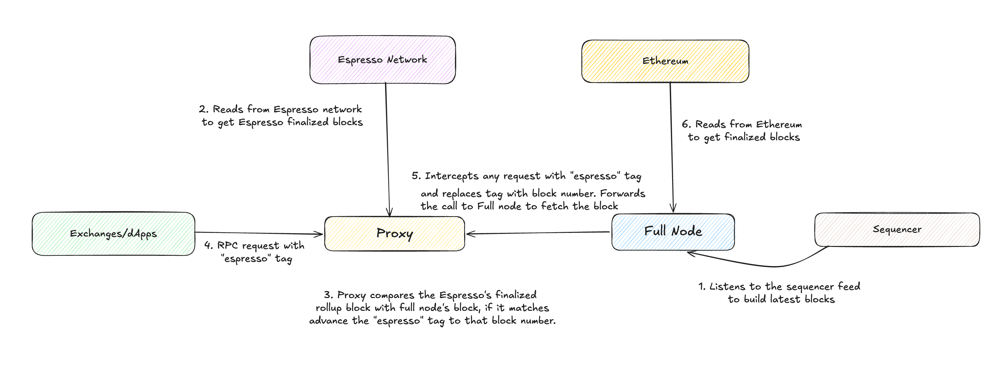

# Espresso Rollup Node Proxy

The Espresso Rollup Node Proxy is a Go service that sits between clients and a rollup's full node to enforce [Espresso](https://docs.espressosys.com/) finality. Instead of relying solely on Ethereum for finality, clients can use an Espresso-specific block tag (default: `"espresso"`) in their JSON-RPC calls; the proxy resolves that tag to the latest L2 block number confirmed by Espresso's HotShot consensus.

The proxy can also be configured to intercept the standard `"finalized"` tag and back it with Espresso finality, so existing clients that already use `"finalized"` get faster finality with no code changes at all.

In both modes, the proxy resolves the block number as `max(espresso finalized, eth finalized)`. This means clients always get Espresso's faster finality when it is ahead, but can safely fall back to Ethereum finality.

The `"espresso"` block number is **monotonically increasing** — it will never move backwards, even across restarts, L1 reorgs, or sequencer reorgs. The finalized block number is persisted to disk, so on restart the proxy resumes from where it left off rather than resetting to zero. This gives clients a stable, safe cursor into the chain that only ever moves forward.

## How it works

**Proxy** — Intercepts every JSON-RPC request (including batch requests) before forwarding it to the full node. Any occurrence of the Espresso tag in the request params is replaced with the current Espresso-finalized L2 block number, then the request is forwarded transparently.

**Verifier** — A background loop continuously compares batches produced by the Espresso streamer against the corresponding blocks on the full node. On a match, the loop advances the store and persists the new L2 block number to disk; on a mismatch, it retries at the next interval.

**Store** — Persists the Espresso-finalized L2 block number and HotShot fallback position to a JSON file so state survives restarts.

The proxy starts in non-Espresso mode and automatically switches to Espresso mode once the verifier confirms the first batch.

## Architecture



## Running the Proxy

### Build

```sh
go build -o espresso-rollup-node-proxy .
```

### Configuration

The proxy is configured via CLI flags or a JSON config file (or both — flags override file values). Pass `--config <path>` to load a file first, then apply any additional flags on top.

**Example config file (OP Stack):**

```json
{
  "full_node_execution_rpc": "<op-geth-rpc>",
  "ws_full_node_execution_rpc": "<op-geth-ws-rpc>",
  "mode": "op",
  "listen_addr": ":8080",
  "ws_listen_addr": ":8081",
  "espresso_tag": "espresso",
  "store_file_path": "/data/espresso_store.json",
  "query_service_url": "<espresso-query-service-url>",
  "verification_interval": "250ms",
  "initial_hotshot_height": 0,
  "op": {
    "l1_rpc": "<l1-rpc>",
    "full_node_consensus_rpc": "<op-node-rpc>",
    "light_client_address": "<light-client-contract-address>",
    "batcher_address": "<batcher-address>",
    "batch_authenticator_address": "<batch-authenticator-contract-address>"
  }
}
```

**Example config file (Nitro):**

```json
{
  "full_node_execution_rpc": "<nitro-rpc>",
  "ws_full_node_execution_rpc": "<nitro-ws-rpc>",
  "mode": "nitro",
  "listen_addr": ":8080",
  "ws_listen_addr": ":8081",
  "espresso_tag": "espresso",
  "store_file_path": "/data/espresso_store.json",
  "query_service_url": "<espresso-query-service-url>",
  "verification_interval": "250ms",
  "nitro": {
    "feed_url": "<nitro-sequencer-feed-ws-url>",
    "namespace": 0,
    "valid_batcher_addresses": [
      { "address": "<batcher-address>", "from": 0, "to": 18446744073709551615 }
    ]
  }
}
```

**Run with a config file:**

```sh
./espresso-rollup-node-proxy --config config.json
```

**Run with flags only (OP Stack):**

```sh
./espresso-rollup-node-proxy \
  --full-node-execution-rpc <op-geth-rpc> \
  --ws.full-node-execution-rpc <op-geth-ws-rpc> \
  --mode op \
  --listen-addr :8080 \
  --ws.listen-addr :8081 \
  --espresso-tag espresso \
  --store-file-path /data/espresso_store.json \
  --query-service-url <espresso-query-service-url> \
  --l1-rpc <l1-rpc> \
  --op.full-node-consensus-rpc <op-node-rpc> \
  --op.light-client-address <light-client-contract-address> \
  --op.batcher-address <batcher-address> \
  --op.batch-authenticator-address <batch-authenticator-contract-address>
```

**Run with flags only (Nitro):**

```sh
./espresso-rollup-node-proxy \
  --full-node-execution-rpc <nitro-rpc> \
  --ws.full-node-execution-rpc <nitro-ws-rpc> \
  --mode nitro \
  --listen-addr :8080 \
  --ws.listen-addr :8081 \
  --espresso-tag espresso \
  --store-file-path /data/espresso_store.json \
  --query-service-url <espresso-query-service-url> \
  --l1-rpc <l1-rpc> \
  --nitro.feed-url <nitro-sequencer-feed-ws-url> \
  --nitro.bridge-address <bridge-contract-address> \
  --nitro.namespace <namespace> \
  --nitro.valid-batcher-addresses <batcher-address>
```

### Docker

**Run with a config file:**

```sh
docker run --rm \
  -v /path/to/config.json:/config.json \
  -v /path/to/data:/data \
  -p 8080:8080 \
  ghcr.io/espressosystems/espresso-rollup-node-proxy:latest \
  --config /config.json
```

**Run with flags only:**

```sh
docker run --rm \
  -v /path/to/data:/data \
  -p 8080:8080 \
  -p 8081:8081 \
  ghcr.io/espressosystems/espresso-rollup-node-proxy:latest \
  --full-node-execution-rpc <op-geth-rpc> \
  --ws.full-node-execution-rpc <op-geth-ws-rpc> \
  --ws.listen-addr :8081 \
  --mode op \
  --store-file-path /data/espresso_store.json \
  --query-service-url <espresso-query-service-url> \
  --l1-rpc <l1-rpc> \
  --op.full-node-consensus-rpc <op-node-rpc> \
  --op.light-client-address <light-client-contract-address> \
  --op.batcher-address <batcher-address> \
  --op.batch-authenticator-address <batch-authenticator-contract-address>
```

Mount a volume for `--store-file-path` so the persisted state survives container restarts.

**Example `docker-compose.yml`:**

```yaml
services:
  espresso-rollup-node-proxy:
    image: ghcr.io/espressosystems/espresso-rollup-node-proxy:latest
    restart: unless-stopped
    ports:
      - "8080:8080"
      - "8081:8081"
    volumes:
      - proxy-data:/data
    command:
      - --full-node-execution-rpc=http://op-geth:8545
      - --ws.full-node-execution-rpc=http://op-geth:8546
      - --mode=op
      - --listen-addr=:8080
      - --ws.listen-addr=:8081
      - --store-file-path=/data/espresso_store.json
      - --query-service-url=<espresso-query-service-url>
      - --l1-rpc=<l1-rpc>
      - --op.full-node-consensus-rpc=http://op-node:9545
      - --op.light-client-address=<light-client-contract-address>
      - --op.batcher-address=<batcher-address>
      - --op.batch-authenticator-address=<batch-authenticator-contract-address>
    depends_on:
      op-geth:
        condition: service_healthy
      op-node:
        condition: service_healthy

  op-geth:
    image: <op-geth-image>
    # ... your op-geth configuration

  op-node:
    image: <op-node-image>
    # ... your op-node configuration

volumes:
  proxy-data:
```

Clients should point at the proxy (`http://localhost:8080`) rather than directly at `op-geth`.

### Configuration Reference

| Flag                               | JSON key                         | Default               | Description                                                                                         |
| ---------------------------------- | -------------------------------- | --------------------- | --------------------------------------------------------------------------------------------------- |
| `--full-node-execution-rpc`        | `full_node_execution_rpc`        | —                     | Rollup execution layer RPC URL (required)                                                           |
| `--ws.full-node-execution-rpc`     | `ws_full_node_execution_rpc`     | —                     | Rollup execution layer WebSocket RPC URL (optional)                                                 |
| `--mode`                           | `mode`                           | —                     | Verifier mode: `op` or `nitro` (required)                                                           |
| `--listen-addr`                    | `listen_addr`                    | `:8080`               | Address the proxy listens on                                                                        |
| `--ws.listen-addr`                 | `ws_listen_addr`                 | —                     | WebSocket Address the proxy listens on (optional)                                                   |
| `--espresso-tag`                   | `espresso_tag`                   | `espresso`            | JSON-RPC block tag to intercept; set to `finalized` to back the standard finality tag with Espresso |
| `--store-file-path`                | `store_file_path`                | `espresso_store.json` | Path to the state persistence file                                                                  |
| `--query-service-url`              | `query_service_url`              | —                     | Espresso query service URL (required)                                                               |
| `--verification-interval`          | `verification_interval`          | `10ms`                | How often the verifier polls for new confirmed batches                                              |
| `--finality-poll-interval`         | `finality_poll_interval`         | `1s`                  | How often the finality poller queries the L2 node for the latest finalized block                    |
| `--initial-hotshot-height`         | `initial_hotshot_height`         | `0`                   | HotShot block height to start streaming from on first run                                           |
| `--max-batch-size`                 | `max_batch_size`                 | `1000`                | Maximum requests in a JSON-RPC batch (0 = unlimited)                                                |
| `--max-request-body-size`          | `max_request_body_size`          | `5242880`             | Maximum request body size in bytes (0 = unlimited)                                                  |
| `--log-level`                      | `log_level`                      | `info`                | Log level (`debug`, `info`, `warn`, `error`)                                                        |
| `--log-format`                     | `log_format`                     | `json`                | Log output format (`text` or `json`)                                                                |
| `--track-batch-latency`            | `track_batch_latency`            | `false`               | Log per-batch and average latency from HotShot finalization to verification                         |
| `--l1-rpc`                         | `l1_rpc`                         | —                     | L1 RPC URL (required)                                                                               |
| `--op.full-node-consensus-rpc`     | `op.full_node_consensus_rpc`     | —                     | OP consensus layer (op-node) RPC URL                                                                |
| `--op.light-client-address`        | `op.light_client_address`        | —                     | Espresso light client contract address on L1                                                        |
| `--op.batcher-address`             | `op.batcher_address`             | —                     | OP batcher address                                                                                  |
| `--op.batch-authenticator-address` | `op.batch_authenticator_address` | —                     | Batch Authenticator contract address on L1                                                          |
| `--nitro.feed-url`                 | `nitro.feed_url`                 | —                     | Nitro full node feed WebSocket URL (Nitro mode, required)                                           |
| `--nitro.bridge-address`           | `nitro.bridge_address`           | —                     | Nitro Bridge contract address on L1 (Nitro mode, required)                                          |
| `--nitro.namespace`                | `nitro.namespace`                | —                     | Nitro Chain Id (Nitro mode, required)                                                               |
| `--nitro.initial-hotshot-block`    | `nitro.initial_hotshot_block`    | `0`                   | Initial HotShot block for the Nitro streamer                                                        |
| `--nitro.valid-batcher-addresses`  | `nitro.valid_batcher_addresses`  | —                     | Valid batcher addresses (Nitro mode, at least one required)                                         |
| `--nitro.wait-for-l1-finalization` | `nitro.wait_for_l1_finalization` | `false`               | Wait for L1 block finalization before fetching delayed messages                                     |

## WebSockets

In order to utilize the WebSocket proxy, two optional configurations **MUST**
be present. We need to know the WebSocket Listening Address, and the
Execution Websocket RPC URL:

| Flag                           | JSON key                     |
| ------------------------------ | ---------------------------- |
| `--ws.listen-addr`             | `ws_listen_addr`             |
| `--ws.full-node-execution-rpc` | `ws_full_node_execution_rpc` |

If one or both of these are not specified, the WebSocket port will not be
enabled. You will see a log message indicating that the server is listening
on the specified WebSocket address, or you will see a log indicating
that the WebSocket proxy is not in effect, or that an error has occurred
parsing the provided Execution WebSocket RPC URL.

## E2E Tests

The `espresso_e2e/` directory contains a battery of integration tests that spin up a full rollup environment via Docker Compose and verify the proxy behaves correctly under adversarial and failure conditions — including L1 reorgs, sequencer reorgs, malicious sequencer feeds, and proxy restarts. In all cases two invariants must hold: the `"espresso"` tag must never move backwards, and it must only advance when the full node's state matches that of Espresso.

Run the e2e tests with `just e2e`.

## Development

Enter the Nix dev shell and use `just`.

```sh
nix develop
```

Run `just test` to execute the unit tests, or `just` with no arguments to list all available recipes.

## License

Copyright (c) 2022 Espresso Systems. The Espresso Rollup Node Proxy was developed by Espresso Systems. While we plan to adopt an open source license, we have not yet selected one. As such, all rights are reserved for the time being. Please reach out to us if you have thoughts on licensing.

## Disclaimer

DISCLAIMER: This software is provided "as is" and its security has not been externally audited. Use at your own risk.

DISCLAIMER: The Go packages provided in this repository are intended primarily for use by the binary targets in this repository. We make no guarantees of public API stability. If you are building on these packages, reach out by opening an issue to discuss the APIs you need.
